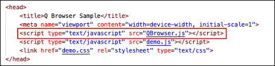

# QuantumPay Browser
{: .fs-9 .no_toc }

This guide describes how to get started using Quantum Pay Browser so your website can interact with QuantumPay. 
{: .fs-5 .fw-300 }

---
<!-- This section reserved for the Table of Contents. Don't remove it. -->
<details open markdown="block">
  <summary>
    Table of contents
  </summary>
  {: .text-delta }
1. TOC
{:toc}
</details>
---

<!-- Add your documentation content below this line -->

## Integration Steps
In order to use Quantum Pay Broswer with your website you will need to do 3 things:

1.	Add the JavaScript library
2.	Add JavaScript code that utilizes functions provided by the library
3.	Link your website to the app

This quick start guide will go over these 3 steps, in order, and give you some sample code for some of the more common use cases of Quantum Pay Browser. 

## Adding QBrowser.js
In order to use Quantum Browser with your website you will need to include QBrowser.js. This file can be found included with our HTML demo here: link. Simply add the JavaScript file to your website like in the image below and you will have access to all the functions it provides.



## About the Demo
If you want to see QBrowser.js in action before making changes to your own code, feel free to check out our HTML demo linked above. The code provided in the demo is the same code used for the default page in the app and should give you a good idea of how to use QBrowser.js and its functions.


## Connecting Your Website
When you are ready to connect your website to Quantum Pay Browser, open the app on your device and follow the steps below.


1. Type in your website’s URL and click “Save Settings”
2. If you ever want the app to open to the default HTML page again, see [Settings](#settings) part below.

## Using QBrowser.js
QBrowser.js will handle all the comunication with QuantumPay Browser need by your application.

### Intro
QBrowser.js uses callback to return data and errors.
For example, this function call will accept 2 functions, the first one for successful call, the second for failure.
```javascript
paymentEngine.build(engineBuildSuccess, engineBuildError);
function engineBuildSuccess() {
    console.log("PaymentEngine is ready!");
}

function engineBuildError(message) {
    alert("PaymentEngine build failed: " + message);
}
```
#### React usage
1. As for Version 1.0.1 React calls need use the functions parameters as string containing the name of the function, so previous call will look like this:
```javascript
paymentEngine.build("engineBuildSuccess", "engineBuildError");
```
2. Callback functions need be global, for example:
```javascript
window.engineBuildSuccess = () => {
    console.log("PaymentEngine is ready!");
};
window.engineBuildError = (message) => {
    alert("PaymentEngine build failed: " + message);
};
```
[See more at our React demo](https://github.com/InfinitePeripherals/QPayBrowser/tree/staging/demos/React)

### Settings
Settings are loaded using provided start page, but if need to change anything later you can do by:
```javascript
QBrowser.Settings.get(loadSettings); // call this from anywhere in your code.
function loadSettings(settings) {
    Object.entries(data).forEach(([key, value]) => console.log(key, value));
    document.getElementById("url").value = data.DefaultUrl;
    document.getElementById("username").value = data.Username;
    document.getElementById("password").value = data.Password;
    document.getElementById("tenantKey").value = data.TenantKey;
    document.getElementById("hostKey").value = data.HostKey;
}

//Save settings:
function saveSettings() {
    QBrowser.Settings.set({
        "DefaultUrl": document.getElementById("url").value, //Set this to '' to see DefaultPage.
        "Username": document.getElementById("username").value,
        "Password": document.getElementById("password").value,
        "TenantKey": document.getElementById("tenantKey").value,
        "HostKey": document.getElementById("hostKey").value
    });
}
```

### QPay


#### Initialization
Method `initialize` must be called first before utilizing any other QPay functions.
This will initilize QPay module with credentials from settings. When the app start, the QuantumPay module must be initialized if payment is required.
This initialization feeds the credentials and tenant keys to the QuantumPay module.
The credentials will be provided by IPCMobile.

```javascript
var qpay = QBrowser.QPay;
qpay.initialize();
```
#### Setup PaymentEngine
1. Set Event Handlers

Set transaction callback functions to receive update throughout the payment process.
```javascript
var paymentEngine = QBrowser.QPay.PaymentEngine;
paymentEngine.setConnectionStateHandler(connectionStateHandler);
paymentEngine.setTransactionResultHandler(transactionResultHandler);
paymentEngine.setTransactionStateHandler(transactionStateHandler);
paymentEngine.setPeripheralStateHandler(peripheralStateHandler);
paymentEngine.setPeripheralMessageHandler(peripheralMessageHandler);
```

2. Build it

Build a PaymentEngine object by setting its behaviour.
```javascript
paymentEngine.builder(qpayError)
    .addPeripheral(qpay.Peripherals.QPP450, null, qpayError)
    .server(qpay.ServerEnvironments.TEST, qpayError)
    .transactionTimeout(30, qpayError)
    .emvApplicationSelectionStrategy(qpay.EmvApplicationSelectionStrategy.FIRST, qpayError)
    .storeAndForward(qpay.StoreAndForwardMode.WHEN_OFFLINE, 60, qpayError)
    .build(engineBuildSuccess, engineBuildError);
```

#### Invoice

Invoice and Transaction must be built after PaymentEngine has successfully created. Depending on your gateway / processor agreement, the invoice data may be mandatory.

1. Setup
```javascript
var invoiceBuilder = QBrowser.QPay.PaymentEngine.buildInvoice("IV12345", qpayError);
invoiceBuilder.companyName("ACME", qpayError);
invoiceBuilder.purchaseOrderReference("PO123", qpayError);
```

2. Add Items

Use this once per item:
```javascript
let invoiceItem = new InvoiceItem(
    "SKU123",
    "VIP Ticket",
    QBrowser.QPay.SaleCode.SALE,
    1,
    QBrowser.QPay.UnitOfMeasure.EACH,
    1.50,
    false,
    1.50,
    0.00,
    0.00,
    1.50
);
invoiceBuilder.addItem(invoiceItem, qpayError);
```

3. Build It

Build invoice with provided params above

```javascript
invoiceBuilder.build(invoiceBuildSuccess, invoiceBuildError);
```

#### Transaction

Transaction must be built after PaymentEngine has successfully created.

1. Build

Build transaction with previous created invoice.
If invoice is null, transaction will be created without invoice. Depending on your gateway / processor agreement, the invoice data may be mandatory.

```javascript
function invoiceBuildSuccess(invoice) {
    buildTransaction(invoice);
}

function buildTransaction(invoice) {
    var transactionBuilder = QBrowser.QPay.PaymentEngine.buildTransaction(invoice, qpayError);
    transactionBuilder.transactionType(QBrowser.QPay.TransactionType.SALE, null, qpayError);
    transactionBuilder.amount(invoice.net.toString(), "USD", qpayError);
    transactionBuilder.build(transactionBuildSuccess, transactionBuildError);
}
```
2. Start Transaction

After building a transaction we can start it:

```javascript
QBrowser.QPay.PaymentEngine.startTransaction(transactionResponse);
// if transaction fail for any reason, the response object will contain error info on why the transaction has failed.
function transactionResponse(response) {
    console.log("Response: " + JSON.stringify(response));
}
```
